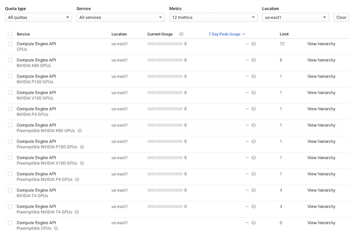

# Terraform template for Folding@home on GCP

[Folding@home is simulating the dynamics of COVID-19 proteins](https://foldingathome.org/covid19/) to hunt for new therapeutic opportunities (recent updates from [Mar 10](https://foldingathome.org/2020/03/10/covid19-update/) and [Feb 27](https://foldingathome.org/2020/02/27/foldinghome-takes-up-the-fight-against-covid-19-2019-ncov/)).
This template is provided to easily run Folding@home on Google Cloud, and help increase total number of simulations done.
You can use this Terraform script to automatically deploy one or more Folding@home clients on GCP. The template creates the instance template with the Folding@home binaries, a managed instance group to uniformly deploy as many clients as specified by user, network firewall rules, and a Cloud NAT gateway for internet access without requiring public IPs, all in an existing or newly created network as specified by user.

This is not an officially supported Google product. Terraform templates for Folding@home are developer and community-supported. Please don't hesitate to open an issue or pull request.

[](https://console.cloud.google.com/cloudshell/open?git_repo=https://github.com/GoogleCloudPlatform/terraform-folding-at-home&page=shell&tutorial=README.md)

### Prerequisites
* GCP project to deploy to.
* Sufficient CPU & GPU resource quota in your GCP project. See [Review project quota](#review-project-quota) below for instructions on who to determine amount of spare quota available.

### Configurable Parameters

Parameter | Description | Default
--- | --- | ---
project | Id of the GCP project to deploy to |
region | Region for cloud resources | 
zones | One or more zones for cloud resources. If not set, up to three zones in the region are used to distributed instances depending on number of instances.<br>**Note on GPU:** Not all regions and zones support all GPUs. If running with GPUs, you should specify explicit list of zones (available for you in your region) that support your selected GPU model. [Refer to list of zones per GPU model](https://cloud.google.com/compute/docs/gpus/#gpus-list)
create_network | Boolean to create a new network | true
network | Network to deploy resources into. It is either: <br>1. Arbitrary network name if create_network is set to true  <br>2. Existing network name if create_network is set to false | fah-network
subnetwork | Subnetwork to deploy resources into It is either: <br>1. Arbitrary subnetwork name if create_network is set to true  <br>2. Existing subnetwork name if create_network is set to false | fah-subnetwork
subnetwork_cidr | CIDR range of subnetwork | 192.168.0.0/16
fah_worker_image | Docker image to use for Folding@home client | stefancrain/folding-at-home:latest
fah_worker_count | Number of Folding@home clients or GCE instances | 3
fah_worker_type | Machine type to run Folding@home client on.<br>**Note on GPU:** only general-purpose N1 machine types currently support GPUs | n1-highcpu-8
fah_worker_gpu | GPU model to attach to each machine running Folding@home client. Possible options: `nvidia-tesla-t4`, `nvidia-tesla-v100`, `nvidia-tesla-p100`, `nvidia-tesla-p4`, `nvidia-tesla-k80`.<br>Set to empty string "" for no GPU. | nvidia-tesla-t4
fah_team_id | Team id for Folding@home client. Defaults to [F@h team Google or 446](https://stats.foldingathome.org/team/446) | 446
fah_user_name | User name for Folding@home client | Anonymous
fah_passkey | User passkey for Folding@home client. This is optional. More details [here](https://foldingathome.org/support/faq/points/passkey/) | *None*

<br>

### Review Project Quota

Before proceeding, you need to ensure you have enough CPU & GPU spare quota in your project, and specifically in the region you intend to deploy to. This template will deploy a fixed-size managed instance group (MIG) with preemptible VMs with GPUs attached for workload acceleration. Note that preemtible VMs can be terminated (and then recreated by MIG) at any time, but run at much lower price than normal instances.

  * Visit https://cloud.google.com/compute/quotas
  * Under Location, search and select a location such as "us-east1"
  * Under Metrics, search for "CPU" and select "CPUs" and "Preemptible CPUs". If you do not have Preemptible CPUs quota, Compute Engine will still use regular CPUs quota to launch preemptible VM instances.
  * Under Metrics, search for "GPU" and select all GPUs except "Commmitted.." ones and the "...Virtual Workstation GPUs". If you do not have Preemptible GPUs quota, Compute Engine will still use regular GPU quotas to add GPUs to preemptible VM instances.
  * You can now determine (1) which GPU models are available and (2) how many spare CPU cores there are for your project and your target region. This gives you maximum size MIG (i.e. the number of VMs each running a Folding@home client) you can deploy, and whether you can attach GPUs (and which GPU device). If desired, you can request for more quota (including separate and additional quota for preemptible CPUs/GPUs), by selecting the specific quota(s), clicking on 'Edit Quotas', and entering the requested 'New quota limit'.

Below a screenshot of a newly created project with a starting quota in '"us-east1" region of 72 CPU cores and 4 Preemptible Nvidia T4 GPUs. In that case, one might opt with a MIG of size 4, where each worker node is a preemptible n1-highcpu-8 with a T4 GPU attached, so a total of 4*8=32 CPUs and 4 T4 GPUs. Here are the relevant parameters in this example:
* fah_worker_count = 4
* fah_worker_type = h1-highcpu-8
* fah_worker_gpu = nvidia-tesla-t4



### Getting Started

#### Requirements
* Terraform 0.12+

#### Setup working directory

1. Run `git submodule init && git submodule update` after cloning to ensure cos-gpu-installer submodule is installed
2. Copy placeholder vars file `variables.yaml` into new `terraform.tfvars` to hold your own settings.
3. Update placeholder values in `terraform.tfvars` to correspond to your GCP environment and desired Folding@home settings. See [list of input parameters](#configurable-parameters) above.
4. Initialize Terraform working directory and download plugins by running `terraform init`.
5. Provide credentials to Terraform to be able to provision and manage resources in your project. See [adding credentials docs](https://www.terraform.io/docs/providers/google/guides/getting_started.html#adding-credentials) to supply a GCP service account key.

#### Deploy Folding@home instances

```shell
$ terraform plan
$ terraform apply
```

#### Access Folding@home process

Once Terraform completes:

1. Confirm Folding@home instance group has been created with correct number of instances
  * Navigate to Compute Enginer -> Instance groups: `https://console.cloud.google.com/compute/instanceGroups/list`
  * Click on the newly created instance group to view its details
  * Confirm number of instances created. Take note of one the instances names and corresponding zone

2. Access one of the new instances via CLI.
  * First, make sure you have IAP SSH permissions for your instances by [following these instructions](https://cloud.google.com/nat/docs/gce-example#step_4_create_ssh_permissions_for_your_test_instance)
  * Type `gcloud compute ssh [INSTANCE_NAME] --zone [INSTANCE_ZONE]` to SSH to the instance you took note previously. Since instances are created without external IP, this will default to using IAP tunnel.

3. View Folding@home container logs
  * Once logged in, retrieve container name via `docker ps`
  * Type `docker logs -tf [CONTAINER_NAME]` to tail the logs and confirm its operation

#### Cleanup

To stop Folding@home client(s) and remove all provisioned resources, type and confirm:

```shell
$ terraform destroy
```

### TODOs

* Add GPU usage logging to Stackdriver for quick monitoring & troubleshooting
* Scale down to 1 when no jobs available
* Scale down to 0 when no jobs available for extended time. Spin back up periodically.

### Support

This is not an officially supported Google product. Terraform templates for Folding@home are developer and community-supported. Please don't hesitate to open an issue or pull request.

### Copyright & License

Copyright 2020 Google LLC

Terraform templates for Folding@home are licensed under the Apache license, v2.0. Details can be found in [LICENSE](./LICENSE) file.
